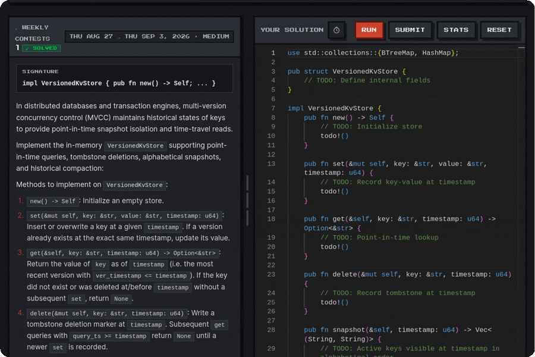

<div align="center">

# Cratery

### Rust Learning Platform & Coding Arena

[](LICENSE)
[](https://www.rust-lang.org)
[](https://react.dev)
[](https://www.typescriptlang.org)
[](https://vitejs.dev)
[](https://workers.cloudflare.com)
[](https://github.com/cratera-project/cratera)

An open-source Rust training platform built around compiler-driven practice, deep language semantics, and isolated code execution.

Solve 680+ questions covering ownership, lifetimes, traits, concurrency, memory layout, macros, and compiler behavior. Write and debug code in the browser, compete in algorithm contests, and run submissions through isolated Firecracker microVMs.

**Cratery is designed to test whether you understand Rust, not just whether you can generate working code.**

[Explore Live Platform](https://cratery.cratera.org) • [Quick Start](#quick-start) • [Curriculum](#curriculum) • [Content & Maintainability](#content-architecture--maintainability) • [Deployment](#deployment-and-self-hosting)

<br />
<br />



</div>

---

## Overview

Cratery delivers focused, hands-on practice for Rust developers, systems engineers, and learners preparing for technical interviews. The platform pairs conceptual diagnostics with real-time compilation, bridging language concepts with hands-on compiler feedback.

**Cratery is the learning platform. [Cratera](https://github.com/cratera-project/cratera) is its isolated code execution backend.**

Code execution runs locally using host compilers during development, or scales across isolated Firecracker microVMs for production grading.

```text
                  ┌───────────────────────────────┐
                  │      Cratery Web Client       │
                  │   (React 19 + TypeScript)     │
                  └───────────────┬───────────────┘
                                  │
                  ┌───────────────┴───────────────┐
                  ▼                               ▼
       ┌────────────────────┐          ┌────────────────────┐
       │   Local Runtime    │          │  Cloudflare Worker │
       │ (Local rustc / DB) │          │  + Supabase Auth   │
       └────────────────────┘          └──────────┬─────────┘
                                                  │
                                                  ▼
                                       ┌────────────────────┐
                                       │ Cratera MicroVMs   │
                                       │ (Firecracker KVM)  │
                                       └────────────────────┘
```

---

## Learn by Reasoning, Not Copying

In an AI-heavy world, generating syntactically valid Rust is trivial—understanding why the compiler rejects or accepts a memory layout is not. 

Cratery focuses on compiler behavior, ownership transfers, lifetime variance, concurrency bounds, and type system subtleties that cannot be mastered by passively copying code. Challenges require you to predict compiler behavior, diagnose borrow checker diagnostics, and reason about why a program is sound or unsound.

**AI can produce the answer. Cratery makes you demonstrate that you understand the answer.**

---

## Core Capabilities

- Deep Rust semantics, borrow checker mechanics, and compiler behavior through 680+ tested and validated questions.
- Interactive coding challenges in the browser with syntax highlighting and instant test feedback.
- Compiler errors, lifetime variance, ownership violations, and concurrency hazards.
- Weekly algorithm contests, community leaderboards, and historical solution archives.
- Create, publish, and solve community quests with automated test harnesses.
- Write and organize interactive markdown technical notes directly alongside code examples.
- The core question catalog, coding exercises, and progress tracking work locally without backend credentials. Cloud synchronization and remote grading are optional.

---

## Curriculum

| Category | Icon | Focus Areas | Problem Types |
| :--- | :---: | :--- | :--- |
| **Forge Trials** | ⚒️ | Live implementation, compiler error resolution, algorithm challenges | Monaco In-Browser Code |
| **Ownership** | 🔒 | Move semantics, Copy vs. Clone, drop flags, resource management | Graded Multiple Choice |
| **Lifetimes** | ⏳ | Lifetime elision, variance, subtyping, unbounded references | Conceptual & Diagnostics |
| **Traits** | 💎 | Associated types, dynamic dispatch, orphan rules, trait bounds | Code Analysis & Output |
| **Concurrency** | ⚔️ | Send and Sync safety, mutexes, channels, atomic memory ordering | Concurrency Safety Drills |
| **Smart Pointers** | 📦 | Box, Rc, Arc, RefCell, custom deref coercion patterns | Memory Layout Analysis |
| **Borrow Checker** | 🚨 | Aliasing rules, mutable reference exclusivity, non-lexical lifetimes | Compiler Diagnostics |
| **Iterators & Closures** | 🔁 | Combinator pipelines, Fn, FnMut, FnOnce captures, zero-cost abstractions | Functional Patterns |
| **Error Handling** | ⚠️ | Result, Option, custom error hierarchies, panic boundaries | Idiomatic Flow Design |
| **Macros** | ✨ | Declarative macro expansions, syntax token matching, metaprogramming | Macro Expansion Drills |

---

## Quick Start

### Prerequisites

- Node.js 20+
- Rust toolchain (`rustc` and `cargo`)

### Local Setup

Run the full platform locally:

```bash
git clone https://github.com/cratera-project/cratery.git
cd cratery
npm install
npm run dev
```

Open `http://localhost:5173` in your browser. The entire question catalog, Forge Trials, and progress tracking initialize immediately in local desktop mode without requiring backend credentials or sign-up.

---

## Architecture & Grading Engines

### Local Evaluation Engine

Development environments compile and evaluate Rust code directly through the host `rustc` binary. Progress, challenge completions, and custom notes persist in browser `localStorage`.

### MicroVM Sandbox Engine

Production deployments route code submissions to Cratera, a Firecracker-based microVM grading cluster. Submissions execute inside isolated Linux guest kernels with strict resource limits, returning execution results, compiler warnings, and test reports with fast compiler and test feedback.

---

## Content Architecture & Maintainability

All educational content across the platform including quiz questions, weekly algorithm contests, and interactive tutorial chapters are managed as structured Markdown (`.md`) files with YAML frontmatter in the [`content/`](content/) directory:

```text
content/
├── questions/                  # Topic-organized quiz questions (680+ files)
│   ├── borrow-checker/
│   ├── concurrency/
│   ├── error-handling/
│   ├── iterators-closures/
│   ├── lifetimes/
│   ├── macros/
│   ├── ownership/
│   ├── pointers/
│   └── traits/
├── contests/                   # Weekly coding contests, signatures, and test harnesses
└── tutorials/                  # Tutorial chapters, concepts, and embedded drills
```

---

## Deployment and Self-Hosting

### Cloudflare Workers Deployment

Deploy Cratery to Cloudflare Workers with edge routing:

```bash
npm run build
npx wrangler deploy
```

### Environment Configuration

Configure optional environment secrets in Cloudflare Workers or `.dev.vars`:

| Variable | Requirement | Description |
| :--- | :--- | :--- |
| `GRADE_URL` | Optional | HTTPS endpoint pointing to a Cratera microVM cluster |
| `GRADE_INTERNAL_KEY` | Optional | Shared authentication secret for the grading cluster |
| `SUPABASE_URL` | Optional | Supabase project URL for cloud authentication and cross-device sync |
| `SUPABASE_ANON_KEY` | Optional | Supabase anonymous public key |
| `SUPABASE_SERVICE_ROLE_KEY` | Optional | Supabase administrative key for backend edge workers |

---

## Quality Assurance & Verification

Every question, contest, and code trial passes automated validation to prevent ambiguous answers and formatting defects:

```bash
# Compile markdown content into generated TypeScript data
npm run build:content

# Run question catalog validation and contest ID checks
npm run check:questions

# Execute linting and static analysis
npm run lint

# Build full distribution bundle
npm run build
```

---

## Tech Stack

| Layer | Technologies |
| :--- | :--- |
| **Frontend UI** | React 19, TypeScript 5, Tailwind CSS, Lucide Icons |
| **Code Editor** | Monaco Editor with Rust syntax highlighting |
| **State & Persistence** | Zustand, LocalStorage, Supabase Database |
| **Edge Compute** | Cloudflare Workers |
| **Sandbox Execution** | Cratera MicroVM Grader, Linux KVM, Firecracker |
| **Tooling & Bundler** | Vite 7, ESLint 9, Wrangler |

---

## Contributing

Contributions expand the catalog and refine educational explanations. Submit new questions, fix errata, or improve editor features through pull requests:

1. Fork the repository.
2. Add or update Markdown content in `content/questions/<category>/`, `content/contests/`, or `content/tutorials/`.
3. Validate content integrity with `npm run check:questions`.
4. Ensure all builds succeed with `npm run build`.
5. Open a descriptive pull request.

Review [`content/questions/README.md`](content/questions/README.md) and [`CONTRIBUTING.md`](CONTRIBUTING.md) for detailed question quality rules and formatting standards.

---

## Community & Support

- Discuss Rust concepts and architecture in the [Cratera Zulip Chat](https://cratera.zulipchat.com).
- Report bugs or request question topics via [GitHub Issues](https://github.com/cratera-project/cratery/issues).
- Explore the grading engine at [Cratera Project](https://github.com/cratera-project/cratera).

---

## License

Distributed under the Apache-2.0 License. See `LICENSE` for details.
